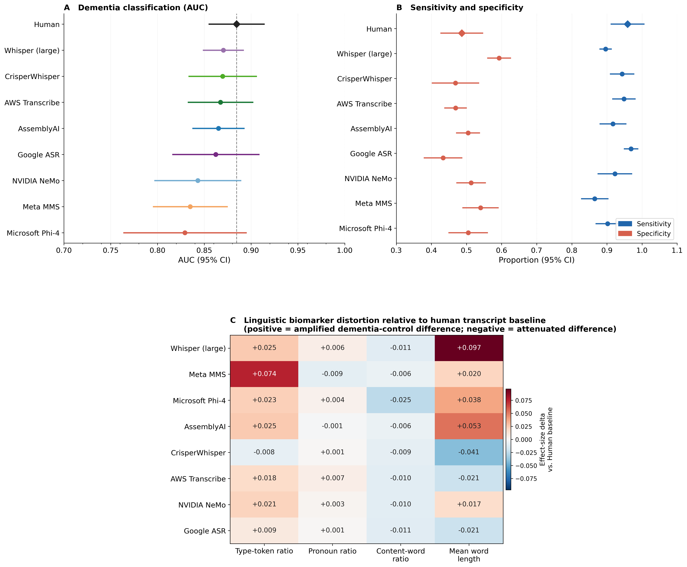

# Clinical Validity of Speech Biomarkers for Dementia Across Automated Transcription Systems

> **Automated transcription preserves clinical validity of speech biomarkers for dementia but introduces system-specific diagnostic bias**

## Overview

This repository contains the analysis code and results for a study evaluating the clinical validity of speech-based dementia detection when models trained on human transcripts are applied to transcripts generated by automatic speech recognition (ASR) systems.

Using 306 speech recordings from older adults with and without dementia, we evaluated eight state-of-the-art ASR systems across three experiments:

- **Experiment 1** - Dementia classification performance (AUC) across 9 transcript sources
- **Experiment 2** - Diagnostic error profiles: false negative and false positive rates per ASR system
- **Experiment 3** - Linguistic biomarker distortion: deviation in group effects relative to human transcripts

Subgroup analyses for Experiment 3 are provided by speech task (monologue vs. picture description), age group, sex, and transcript length quartile.

## Summary Figure



**A.** Classification performance (AUC) when a model trained on human transcripts is evaluated on human and ASR-generated transcripts. Error bars = standard error across cross-validation folds.
**B.** Diagnostic error trade-off across ASR systems (false negative rate vs. false positive rate).
**C.** Linguistic biomarker distortion - deviation in group effect relative to human transcripts for TTR, pronoun ratio, content-word ratio, and mean word length.

## Key Findings

- Classification performance remained close to the human baseline across all ASR systems, with the best-performing ASR systems (CrisperWhisper, Whisper) achieving AUC = 0.870 vs. human AUC = 0.884
- Despite similar overall performance, ASR systems produced substantially different diagnostic error profiles
- All four linguistic biomarkers showed significant Group x Transcription Source interactions, indicating system-specific distortion of clinically relevant signals
- Biomarker distortion was most pronounced in monologue speech and in shorter recordings
- Transcription accuracy alone is insufficient to evaluate ASR systems for clinical deployment - downstream clinical validity must be assessed

## ASR Systems Evaluated

| System | Type |
|---|---|
| AWS Transcribe Medical | Commercial |
| Google Speech-to-Text | Commercial |
| AssemblyAI | Commercial |
| Microsoft Phi-4 | Open (CC-BY-4.0) |
| OpenAI Whisper (large-v2) | Open-source (MIT) |
| CrisperWhisper | Open-source (MIT) |
| NVIDIA NeMo | Open-source (Apache 2.0) |
| Meta MMS | Open-source (CC-BY-NC) |

## Repository Structure

```
├── data/
│   ├── Transcription.csv                  # Anonymised transcripts (human + 8 ASR systems)
│   ├── exp1_filewise_predictions_long.csv # Exp 1: per-recording classification predictions
│   ├── exp2_error_rates_summary_vs_human.csv # Exp 2: error rates vs. human baseline
│   ├── exp2_fold_source_error_rates.csv   # Exp 2: fold-level error rates
│   ├── exp3_biomarker_distortion.csv      # Exp 3: biomarker group effects per ASR system
│   ├── exp3_filewise_predictions_long.csv # Exp 3: per-recording biomarker values
│   ├── exp3_subgroup_results.csv          # Exp 3: subgroup analysis results
│   └── transcript_length_summary.csv      # Transcript word count summary
├── scripts/
│   ├── rerun_participant_level_cv.py      # Main analysis: Experiments 1, 2, and 3
│   └── exp3_subgroup_analyses.py         # Subgroup analyses for Experiment 3
└── figures/
    ├── Figure2_summary.png               # Main results figure
    └── Figure2_summary.pdf
```

## Data and Anonymisation

Speech transcripts (human and ASR-generated) are provided in `data/Transcription.csv`. Recordings are identified by sequential anonymous IDs (1.wav to 306.wav). Original participant identifiers, age, and sex have been removed from all shared files. Audio recordings are not publicly available due to participant privacy. Access can be requested through the corresponding author.

The transcript text contains naturalistic speech and may include incidental mentions of place names or general references, which are part of the speech content and have been retained to preserve linguistic validity.

## Requirements

```
Python 3.14+
scikit-learn >= 1.8.0
pandas >= 3.0.0
numpy >= 2.4.0
scipy >= 1.17.0
statsmodels >= 0.14.0
matplotlib >= 3.10.0
seaborn >= 0.13.0
```

Install via:
```bash
pip install scikit-learn pandas numpy scipy statsmodels matplotlib seaborn
```

## Running the Analysis

```bash
# Experiments 1, 2, and 3
python scripts/rerun_participant_level_cv.py

# Experiment 3 subgroup analyses
python scripts/exp3_subgroup_analyses.py
```

## License

Code is released under the MIT License. Data files are shared for research reproducibility only and may not be redistributed without permission.

## Contact

- Thayabaran Kathiresan — thayabaran.kathiresan@unimelb.edu.au
- Adam P. Vogel — vogela@unimelb.edu.au
